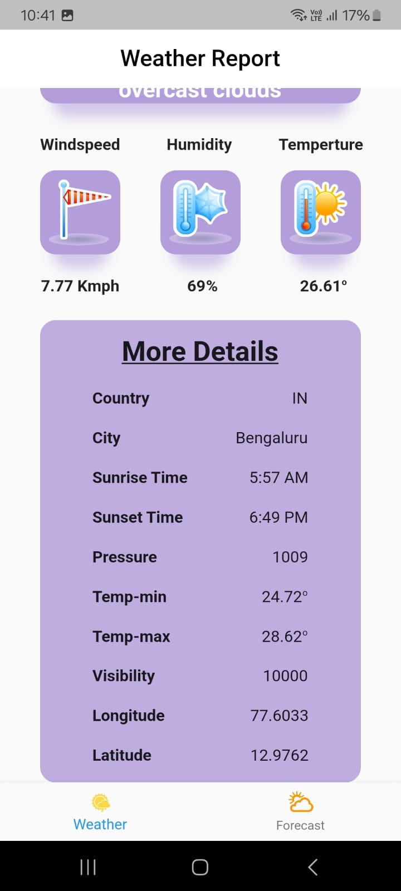

# Weatherapp

WeatherApp is create by flutter with Openweather Api.

Explanation:
1.WeatherApp Class: Sets up the basic MaterialApp with a WeatherScreen as the home screen.
2.WeatherScreen Class: Stateful widget that manages the weather fetching logic.
3.fetchWeather Method: Makes a GET request to the OpenWeather API using the city name entered by the user.
4.UI: Includes a TextField for input, a CircularProgressIndicator for loading, and Text widgets to display the weather description and temperature.

Above is the code.

